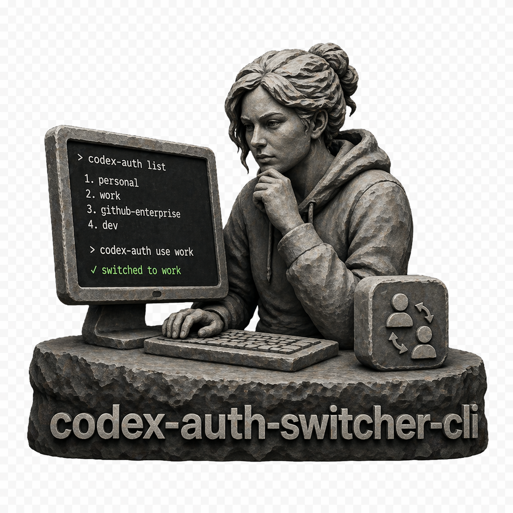

<p align="center">
  
</p>

<h1 align="center">authmux</h1>

<p align="center">
  multi-account Codex auth switching for local CLI workflows
</p>

<p align="center">
  save named auth snapshots, switch accounts instantly, and keep each terminal pinned to the right login
</p>

<p align="center">
  <a href="https://www.npmjs.com/package/authmux">
    
  </a>
  <a href="https://www.npmjs.com/package/authmux">
    
  </a>
  <a href="https://github.com/recodeee/authmux">
    
  </a>
  <a href="https://github.com/recodeee/authmux/commits/main">
    
  </a>
  <a href="https://github.com/recodeee/authmux/blob/main/LICENSE">
    
  </a>
</p>

<p align="center">
  <a href="#how-it-works">About</a>
  ·
  <a href="#install-npm">Install</a>
  ·
  <a href="#usage">Usage</a>
  ·
  <a href="#command-reference">Commands</a>
  ·
  <a href="#auto-switch-behavior">Auto-switch</a>
  ·
  <a href="#managed-background-service">Service</a>
</p>

A command-line tool that lets you manage and switch between multiple Codex accounts instantly, no more constant logins and logouts.

> [!WARNING]
> Not affiliated with OpenAI or Codex. Not an official tool.

## How it Works

Codex stores your authentication session in a single `auth.json` file. This tool works by creating named snapshots of that file for each of your accounts. When you want to switch, `authmux` swaps the active `~/.codex/auth.json` with the snapshot you select, instantly changing your logged-in account.

`authmux` also keeps a lightweight per-terminal session memory (scoped by shell parent PID by default), so older terminals keep using their original snapshot even if a different terminal logs into another account later.

## Requirements

- Node.js 18 or newer

## Install (npm)

```sh
npm i -g authmux
```

During global install, the package asks for permission to add an optional shell hook
(`~/.bashrc` or `~/.zshrc`) that auto-runs a silent snapshot sync after successful
official `codex login`.

On later global updates, if the hook is already installed, `authmux` refreshes the
hook block automatically to the latest template (no manual remove/setup needed).
The refreshed hook always wraps `codex` in your shell so sync/restore still run even if
another shell config already defined `codex` as a function.

- Choose `y` to enable fully automatic login snapshot capture.
- Choose `n` (default) to skip.
- Set `CODEX_AUTH_SKIP_POSTINSTALL=1` to always suppress this prompt.
- Set `CODEX_AUTH_SKIP_TTY_RESTORE=1` to keep the hook from restoring terminal modes after `codex` exits.
- Set `CODEX_AUTH_SESSION_KEY=<id>` to explicitly scope session-memory identity (optional; default uses shell PPID).
- For a calmer Codex footer, prefer a focused `[tui] status_line` such as:

  ```toml
  [tui]
  status_line = ["model-with-reasoning", "git-branch", "context-remaining"]
  ```

  This remains a manual Codex config choice; `authmux` does not rewrite `~/.codex/config.toml`.

## Usage

```sh
# login to Codex and immediately snapshot the refreshed auth session
authmux login [name]

# headless/remote login flow + snapshot
authmux login [name] --device-auth

# force overwrite when reusing a name across different detected identities
authmux login [name] --force

# save the current logged-in token as a named account
authmux save <name>

# force overwrite a name even when it currently maps to a different email
authmux save <name> --force

# switch active account
authmux use <name>

# or pick interactively
authmux use

# list accounts
authmux list

# bare list shows the saved account/snapshot name first,
# then the account type and remaining 5h/weekly quota percentages
# (the active row is marked with `*`)
#   admin@compastor.com  type=ChatGPT seat (Business)  5h=1%  weekly=22%
# * recodee@portasmosonmagyarovar.hu  type=Usage based (Codex)  5h=99%  weekly=44%

# list accounts with mapping metadata (email/account/user/usage)
authmux list --details

# show current account name
authmux current

# check for a newer release and update globally
authmux update

# check only (no install)
authmux update --check

# reinstall latest even if already up to date
authmux update --reinstall

# remove accounts (interactive multi-select)
authmux remove

# remove by selector or all
authmux remove <query>
authmux remove --all

# show auto-switch + service status
authmux status

# auto-switch configuration
authmux config auto enable
authmux config auto disable
authmux config auto --5h 12 --weekly 8

# usage source configuration
authmux config api enable
authmux config api disable

# daemon runtime (internal/service use)
authmux daemon --once
authmux daemon --watch

# optional shell hook helpers
authmux hook-install
authmux hook-status
authmux hook-remove
```

### Command reference

- `authmux save <name> [--force]` – Validates `<name>`, ensures `auth.json` exists, then snapshots it to `~/.codex/accounts/<name>.json`. By default, it blocks overwriting a name when the existing snapshot email differs from current auth. If `name` is omitted, it first tries reusing the active snapshot name when identity matches; otherwise it infers one from auth email.
- `authmux login [name] [--device-auth] [--force]` – Runs `codex login` (optionally with device auth), waits for refreshed auth snapshot detection, then saves it. If `name` is omitted, it always infers one from auth email with unique-suffix handling for multi-workspace identities.
- `authmux use [name]` – Accepts a name or launches an interactive selector with the current account pre-selected, writes `~/.codex/auth.json` as a regular file from the chosen snapshot, and records the active name.
- `authmux list [--details]` – Lists all saved snapshots alphabetically. In the default view, each row starts with the saved account/snapshot name, followed by `type=`, `5h=`, and `weekly=` values, and the active row is marked with `*`. `type=` renders Codex usage-based plans as `Usage based (Codex)` and ChatGPT seat plans with their tier, such as Plus, Business, Pro, or Max. `--details` adds per-snapshot mapping metadata (email, account id, user id, raw plan, usage metadata, and friendly type) for easier session/account troubleshooting.
- `authmux current` – Prints the active account name, or a friendly message if none is active.
- `authmux update [--check] [--reinstall] [-y]` – Checks npm for newer release metadata. `--check` prints current/latest/status only. `--reinstall` forces reinstall even when already up to date. `-y` skips confirmation prompts.
- `authmux remove [query|--all]` – Removes snapshots interactively or by selector. If the active account is removed, the best remaining account is activated automatically.
- `authmux status` – Prints auto-switch state, managed service status, active thresholds, and usage mode.
- `authmux config auto ...` – Enables/disables managed auto-switch and updates threshold percentages.
- `authmux config api enable|disable` – Chooses usage source mode (`api` or `local`).
- `authmux daemon --once|--watch` – Runs the auto-switch loop once or continuously.
- `authmux hook-install [-f <path>]` – Installs or refreshes an optional shell hook in your rc file to restore session-pinned snapshot before each `codex` run, refresh authmux session memory after each `codex` exit, and restore common terminal modes before returning to your prompt.
- `authmux hook-status [-f <path>]` – Shows whether the optional login auto-snapshot hook is installed for the selected rc file.
- `authmux hook-remove [-f <path>]` – Removes the optional shell hook.

### Auto-switch behavior

When auto-switch is enabled, the daemon evaluates the active account and switches when either threshold is crossed:

- `5h` remaining `< threshold5h` (default `10%`)
- `weekly` remaining `< thresholdWeekly` (default `5%`)

Usage refresh is hybrid:

1. API mode (`config api enable`): query ChatGPT usage endpoint for each account.
2. Local fallback: active account usage can fall back to local session rollout logs when API data is unavailable.

### Managed background service

`authmux config auto enable` installs a managed watcher per OS:

- Linux: user `systemd` service
- macOS: LaunchAgent
- Windows: Scheduled Task

`authmux status` reports whether the managed watcher is active.

## Claude Code Parallel Accounts

Run multiple Claude Code subscriptions simultaneously in separate terminals — each with its own credentials and usage limits.

### Quick setup (CLI)

```sh
# Add profiles
authmux parallel --add work
authmux parallel --add personal

# Install shell aliases into ~/.bashrc or ~/.zshrc
authmux parallel --install

# Reload shell
source ~/.bashrc  # or ~/.zshrc

# Authenticate each in separate terminals
claude-work       # logs in, credentials saved to ~/.claude-accounts/work
claude-personal   # logs in, credentials saved to ~/.claude-accounts/personal
```

### Quick setup (standalone script)

```sh
./scripts/claude-parallel-setup.sh work personal client
source ~/.bashrc
```

### Commands

```sh
authmux parallel --add <name>     # Create a new profile
authmux parallel --remove <name>  # Remove a profile
authmux parallel --list           # List all profiles
authmux parallel --aliases        # Print aliases (without installing)
authmux parallel --install        # Write aliases to shell rc file
```

### How it works

Each profile gets its own config directory at `~/.claude-accounts/<name>`. Shell aliases set `CLAUDE_CONFIG_DIR` before launching `claude`, so each instance uses isolated credentials, settings, and history. Run them in separate terminal tabs or tmux panes for true parallel usage.

### Notes

- Requires a separate Anthropic subscription (different email) per profile.
- Works on macOS and Linux. For Windows, use PowerShell functions with `$env:CLAUDE_CONFIG_DIR`.
- To share settings across profiles, symlink specific files between config dirs.
- Check Anthropic's terms of service for compliance.

---

Notes:

- Works on macOS/Linux/Windows (regular-file auth snapshot activation).
- Requires Node 18+.
- Running bare `authmux` shows the help screen and also displays an update notice when a newer npm release is available.
- Running bare `authmux` now prompts to install updates immediately when a newer npm release is available (`[Y/n]`, Enter defaults to yes).
